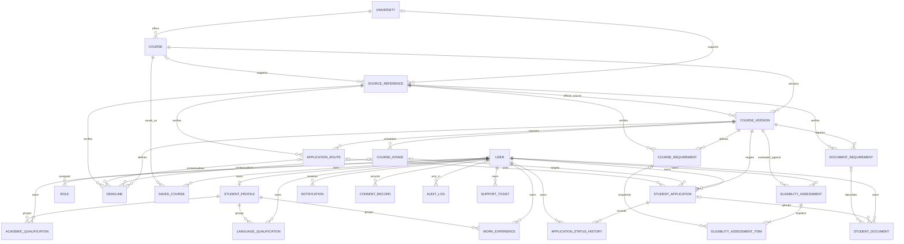

# MVP Database Schema

## Purpose and design principles

The MVP schema is a PostgreSQL relational model implemented with Entity Framework Core. It separates identity, student-owned data, versioned catalogue facts, application workflow, privacy, and audit records. It does not store university portal credentials or document file contents.

- UUID primary keys are used for application and ASP.NET Identity records.
- `timestamptz`/`DateTimeOffset` values are written in UTC. Authoritative deadlines additionally retain local date, optional local time, and IANA timezone.
- Mutable application entities have `CreatedAt`, `UpdatedAt`, and an optimistic `ConcurrencyToken`. Identity uses its established concurrency stamp plus timestamps.
- All foreign keys use `RESTRICT` to prevent accidental cascading deletion, especially across student-owned data and immutable history.
- Soft deletion is limited to users, universities, courses, and student document metadata where records may need to disappear from ordinary reads while an approved retention/deletion workflow completes.
- Eligibility assessments, assessment items, application status history, consent records, and audit logs are immutable after insertion.
- Course facts belong to immutable-intent numbered `CourseVersion` records. A database check prevents publication without an official source, verification time, publication time, or when a record is development sample data.
- Requirement facts are typed rows (`RequirementType`, `RequirementOperator`, typed value, unit, mandatory flag, source) rather than an unstructured requirements blob.

## Entity groups

### Identity and student profile

`User` and `Role` extend ASP.NET Identity. A user owns at most one `StudentProfile`; qualifications and work experience retain both `UserId` ownership and `StudentProfileId` grouping. Direct ownership indexes support secure, bounded user queries. User deletion cannot cascade into these records.

### Catalogue and provenance

`University` owns stable `Course` identities. Every changeable presentation of a course is a numbered `CourseVersion`. Requirements, intakes, routes, deadlines, and document requirements point to a particular version so historical applications and assessments remain reproducible.

`SourceReference` records URL, title, official status, verifier label, and verification timestamp. Published versions require `OfficialSourceReferenceId`, `VerifiedAt`, and `PublishedAt`. Application routes, deadlines, requirements, and document requirements also require their own source relationship.

### Student workflows

`SavedCourse`, `EligibilityAssessment`, `StudentApplication`, `StudentDocument`, `Notification`, `ConsentRecord`, and `SupportTicket` all carry a non-null `UserId`. Status history also carries `UserId`, making ownership checks possible without trusting a client-provided user identifier.

Eligibility assessments save the evaluated course version, rule-set version, disclaimer acknowledgement, input snapshot, outcome, and per-rule snapshots. They are append-only: a later assessment creates a new record rather than changing an old decision-support result.

`StudentDocument` stores checklist/file metadata only: display/original name, type, media type, byte size, SHA-256 checksum, checklist status, and relationships. There is no binary content or third-party password field.

## ER diagram



## Publication and provenance invariants

The `ck_course_version_publication_source` check permits a `Published` status only when:

1. `OfficialSourceReferenceId` is present;
2. `VerifiedAt` is present;
3. `PublishedAt` is present; and
4. `IsDevelopmentSample` is false.

A deferred PostgreSQL constraint trigger additionally requires the referenced source to be marked official, have a verified timestamp, and use HTTPS. Application validation must still confirm that the URL belongs to an approved university/application-service domain, matches the course context, and satisfies the configured freshness policy.

## Deletion and history

- Every relationship is `ON DELETE RESTRICT`; privacy erasure must be an explicit, ordered, audited workflow rather than an incidental cascade.
- Soft-delete query filters hide `User`, `University`, `Course`, and `StudentDocument` rows from normal reads. Administrative/privacy operations that intentionally inspect them must explicitly opt out of query filters and remain authorised/audited.
- Course versions and official-source history are retained rather than overwritten.
- Assessments, assessment items, consent events, status events, and audit records reject EF updates/deletes, and PostgreSQL append-only triggers reject direct updates/deletes. Corrections are represented by new events according to the applicable retention policy.
- Retention and legal-erasure periods remain unresolved governance decisions; the schema does not itself establish a lawful retention duration.

## Index strategy

| Query area | Important indexes |
|---|---|
| Course search | Published status/discipline/language, trigram GIN title, university/name, stable course code/version uniqueness |
| Deadlines | Deadline date/applicant category and course-version/intake |
| Ownership | User/time or user/status indexes on profiles, saved courses, assessments, applications, documents, notifications, consents, tickets, and status history |
| Workflow | Application status/update time, notification status/schedule, ticket status/priority, assessment outcome |
| Provenance/audit | Source URL and course/official/verified time; audit occurred time, actor/time, and target/time |

Indexes should be revisited with real, privacy-safe query plans and representative volumes. Avoid indexing sensitive free text or JSON snapshots unless a documented use case and privacy review require it.

## Development seed structure

The model seed contains only:

- five role definitions: `Student`, `ContentAuthor`, `ContentReviewer`, `PrivacySupport`, and `SecurityAdministrator`; and
- one synthetic university with two synthetic, explicitly labelled, development-only draft courses.

The synthetic courses have no source URL, cannot satisfy the publication constraint while marked as development samples, and must never be presented as real programmes. No users, student profiles, qualifications, applications, documents, consent events, or other personal data are seeded.

## Migration operations

The initial migration enables `pg_trgm`, creates the schema and restrictive foreign keys, creates indexes/check constraints, and inserts the development seed structure. Apply it with:

```bash
dotnet ef database update \
  --project backend/src/GermanyApplications.Api \
  --startup-project backend/src/GermanyApplications.Api
```

Set `ConnectionStrings__DefaultConnection` to the local PostgreSQL connection before running the command. Existing migrations are immutable; later changes require a new reviewed migration.
